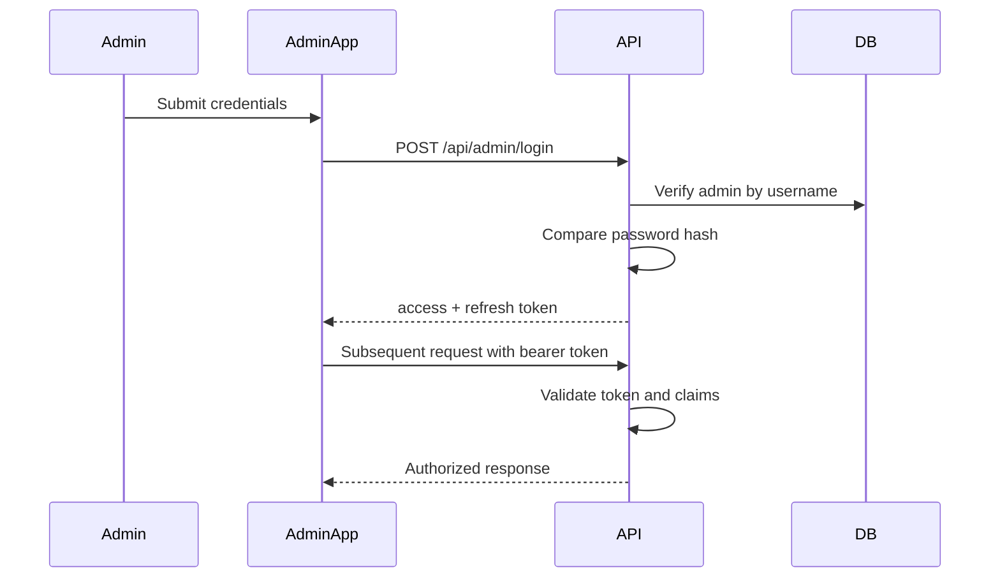

# Backend Architecture

## Service Architecture
### Controller/Route Organization
```text
services/api/src/
  modules/
    auth/
    events/
    lessons/
    materials/
    quizzes/
    public/
  plugins/
  middleware/
  lib/
  app.ts
  server.ts
```

### Controller Template
```ts
import type { FastifyInstance } from 'fastify';

export async function registerEventRoutes(app: FastifyInstance) {
  app.get('/api/events', async (_req, reply) => {
    return reply.send({ items: [] });
  });
}
```

## Database Architecture
### Schema Design
(See complete SQL DDL in Database Schema section.)

### Data Access Layer
```ts
export interface EventRepository {
  list(): Promise<Event[]>;
  findById(id: string): Promise<Event | null>;
  create(input: CreateEventInput): Promise<Event>;
  update(id: string, input: UpdateEventInput): Promise<Event>;
  remove(id: string): Promise<void>;
}
```

## Authentication and Authorization
### Auth Flow


### Middleware/Guards
```ts
import type { FastifyReply, FastifyRequest } from 'fastify';

export async function requireAdmin(req: FastifyRequest, reply: FastifyReply) {
  const auth = req.headers.authorization;
  if (!auth?.startsWith('Bearer ')) {
    return reply.code(401).send({ error: 'UNAUTHORIZED' });
  }
  // token verification + claims checks here
}
```
