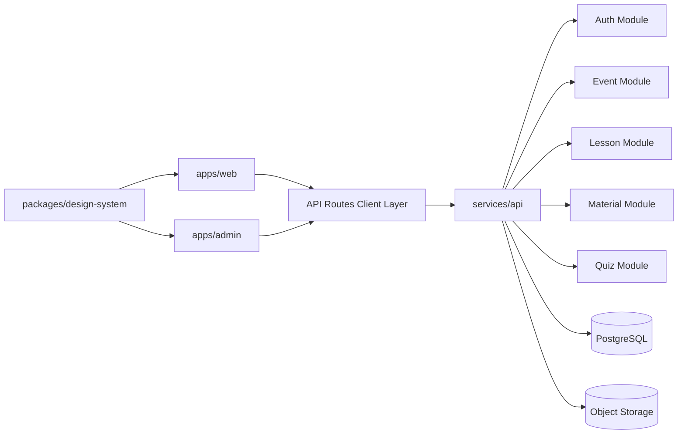

# Components

## apps/web (Learner App)
**Responsibility:** Event discovery, lesson playback, materials and quiz UX.

**Key Interfaces:**
- GET `/api/public/events/{slug}`
- POST `/api/events/{slug}/access`
- GET `/api/public/lessons/{id}/access`
- GET `/api/lessons/{id}/materials`
- POST `/api/quizzes/{id}/submit`

**Dependencies:** `@flix/design-system`, API client, shared types  
**Technology Stack:** Next.js + TanStack Query + Tailwind

## apps/admin (Admin App)
**Responsibility:** Authenticated operational panel for content lifecycle.

**Key Interfaces:**
- POST `/api/admin/login`
- CRUD `/api/events`, `/api/lessons`, `/api/quizzes`
- upload `/api/lessons/{id}/materials`

**Dependencies:** `@flix/design-system`, API client, shared types  
**Technology Stack:** Next.js + TanStack Query + Tailwind

## services/api
**Responsibility:** Domain services, validation, security, persistence orchestration.

**Key Interfaces:**
- REST endpoints for auth/events/lessons/materials/quizzes
- health/readiness endpoints

**Dependencies:** PostgreSQL, storage adapter, auth adapter, logging layer  
**Technology Stack:** Fastify + TypeScript + query layer (Prisma/Drizzle)

## packages/design-system
**Responsibility:** Canonical visual tokens/foundations/components for both apps.

**Key Interfaces:**
- token exports
- primitive/shared UI components

**Dependencies:** Tailwind config, React primitives  
**Technology Stack:** TypeScript package with token/component exports

## Component Diagram

