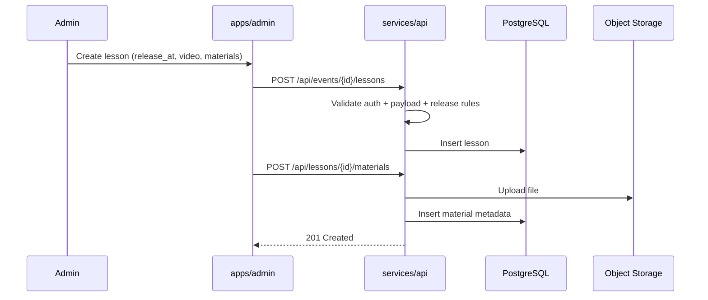
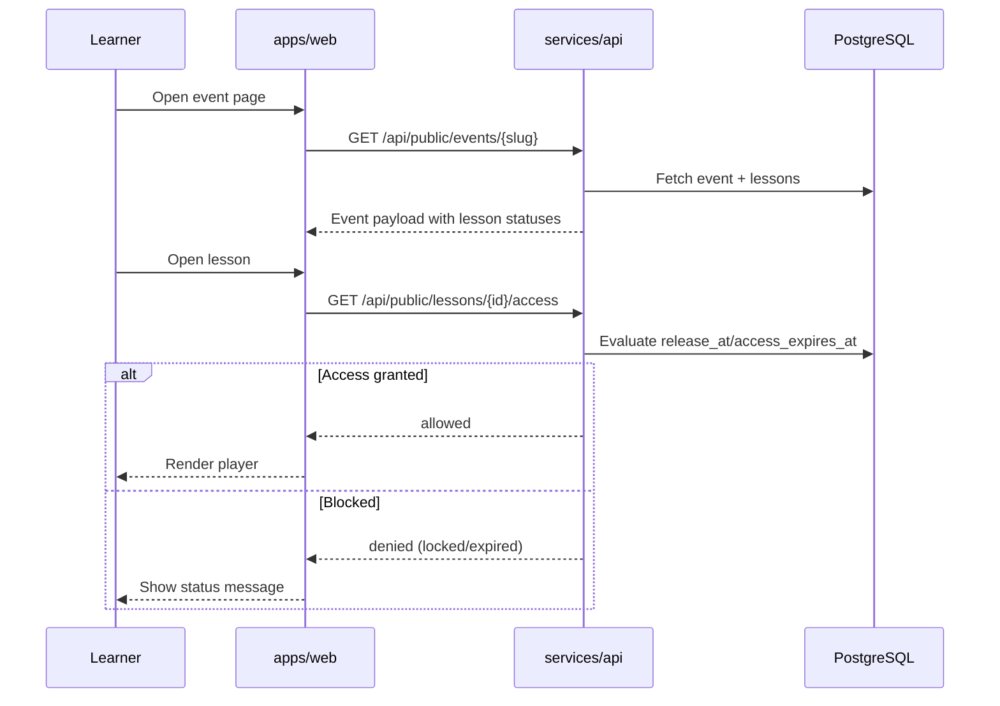

# Core Workflows

```mermaid
sequenceDiagram
  participant Admin
  participant AdminApp as apps/admin
  participant API as services/api
  participant DB as PostgreSQL
  participant Store as Object Storage

  Admin->>AdminApp: Create lesson (release_at, video, materials)
  AdminApp->>API: POST /api/events/{id}/lessons
  API->>API: Validate auth + payload + release rules
  API->>DB: Insert lesson
  AdminApp->>API: POST /api/lessons/{id}/materials
  API->>Store: Upload file
  API->>DB: Insert material metadata
  API-->>AdminApp: 201 Created
```

```mermaid
sequenceDiagram
  participant Learner
  participant WebApp as apps/web
  participant API as services/api
  participant DB as PostgreSQL

  Learner->>WebApp: Open event page
  WebApp->>API: GET /api/public/events/{slug}
  API->>DB: Fetch event + lessons
  API-->>WebApp: Event payload with lesson statuses

  Learner->>WebApp: Open lesson
  WebApp->>API: GET /api/public/lessons/{id}/access
  API->>DB: Evaluate release_at/access_expires_at
  alt Access granted
    API-->>WebApp: allowed
    WebApp-->>Learner: Render player
  else Blocked
    API-->>WebApp: denied (locked/expired)
    WebApp-->>Learner: Show status message
  end
```
