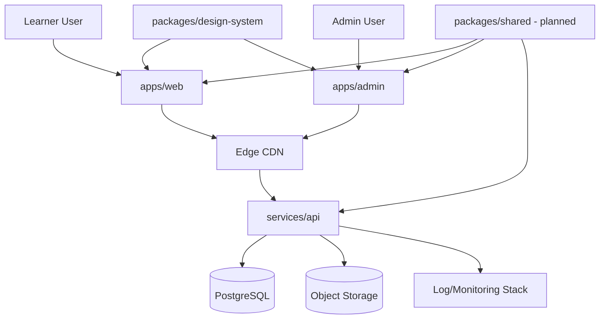

# High Level Architecture

## Technical Summary
Flix uses a monorepo architecture with separate apps for learner-facing web and admin portal, plus a single backend API service and a shared design-system package. The backend follows a modular monolith pattern for MVP speed, with domain modules for auth, events, lessons, materials, and quizzes. Frontend apps consume the same API contracts and shared UI tokens/components to keep UX consistency while allowing product-specific views. Deployment targets prioritize fast iteration and low operational overhead, with edge delivery for frontend and managed runtime for API/database/storage. The architecture enforces server-authoritative checks for both journey visibility (`public`/`private`) and lesson release-window access to protect gated content. This design directly supports PRD goals for end-to-end publishing operations, learner playback flow, and responsive UX.

## Platform and Infrastructure Choice
- Option 1: Vercel + Railway + Postgres + S3-compatible storage  
  Pros: fast DX, simple rollout, good fit for JS monorepo; Cons: multi-provider ops.
- Option 2: Full AWS (CloudFront, ECS/Lambda, RDS, S3, Cognito)  
  Pros: enterprise-grade scale/security; Cons: higher setup/ops overhead for MVP.
- Option 3: Supabase + Vercel  
  Pros: accelerated backend primitives; Cons: less control if custom auth/domain rules grow quickly.

**Recommendation:** Option 1 (Vercel + Railway + Postgres + object storage).  
It balances MVP speed, cost, and control while preserving a clean migration path to more advanced infrastructure.

**Platform:** Hybrid (Vercel + Railway + Managed Postgres + Object Storage)
**Key Services:** Vercel hosting, Railway API runtime, PostgreSQL, S3-compatible bucket, CDN/edge cache, centralized logs
**Deployment Host and Regions:** Primary region `us-east-1` (or closest to target audience), CDN global edge

## Repository Structure
**Structure:** Monorepo  
**Monorepo Tool:** npm workspaces (already active)  
**Package Organization:**
- `apps/web` - learner experience
- `apps/admin` - operational/admin experience
- `services/api` - backend API
- `packages/design-system` - canonical UI tokens/components
- `packages/config` (planned) - shared lint/tsconfig/test config
- `packages/shared` (planned) - shared types/contracts

## High Level Architecture Diagram

## Architectural Patterns
- **Monorepo with bounded apps/services/packages:** Shared contracts and faster cross-stack delivery - _Rationale:_ aligns with FR17 and reduces integration drift.
- **Modular Monolith Backend:** Domain modules under one deployable API - _Rationale:_ MVP speed with clear future extraction paths.
- **Server-authoritative access control:** Release/expiry checks in backend - _Rationale:_ enforce FR5-FR7 reliably.
- **Journey visibility gating:** Event-level `public/private` access policy - _Rationale:_ enforce FR20/FR21 and prevent private catalog leakage.
- **Design-system-first UI foundation:** Token/component reuse across apps - _Rationale:_ supports NFR5 and UX consistency goals.
- **API-first integration contract:** OpenAPI-driven endpoints and DTOs - _Rationale:_ predictable FE/BE collaboration and testability.
- **Defense in depth security:** validation, auth middleware, rate limiting, secure headers - _Rationale:_ satisfy NFR1/NFR2/NFR10.
